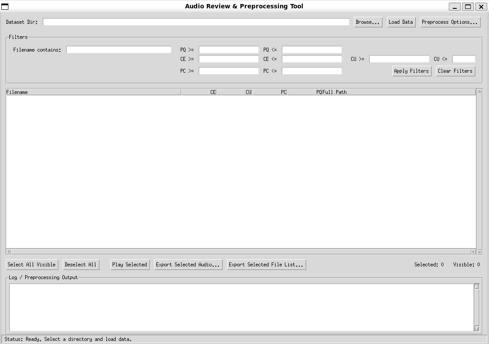

      
# Audio Review and Preprocessing Tool

A graphical tool built with Python and Tkinter to facilitate the review, sorting, filtering, and batch processing of audio datasets, particularly those generated or analyzed using tools like Facebook's AudioBox or similar methods that produce per-file quality/metric scores.

This tool helps manage large audio datasets by providing:
*   A sortable and filterable table view of audio files and their associated scores (e.g., CE, CU, PC, PQ).
*   Integrated audio playback.
*   Batch preprocessing capabilities using an external command (like `audio-aes`).
*   Options to export selected audio files (concatenated) or just their file paths for use in training scripts.


*(Suggestion: Add a screenshot of the application here)*

## Features

*   **Directory Loading:** Load audio metadata (`paths.jsonl`, `scores.jsonl`) recursively from subdirectories within a selected base directory.
*   **Data Display:** View audio filenames, scores, and full paths in a sortable table.
*   **Filtering:** Filter the displayed audio files based on filename (contains) and score ranges (CE, CU, PC, PQ min/max).
*   **Sorting:** Sort the displayed data by clicking on column headers.
*   **Audio Playback:** Play selected individual audio files directly within the tool (requires `pygame`).
*   **Preprocessing:**
    *   Run a configurable external command (e.g., `audio-aes`) on subdirectories to generate `scores.jsonl` from `paths.jsonl`.
    *   Automatically generates `paths.jsonl` (list of `.wav` files) if needed.
    *   Option to skip directories where `scores.jsonl` already exists (avoids reprocessing).
    *   Option to overwrite existing `scores.jsonl`.
    *   Progress reporting in the status bar and log window.
*   **Exporting:**
    *   **Concatenated Audio:** Select multiple files and export them as a single combined WAV or MP3 file (MP3 requires FFmpeg).
    *   **File List:** Select multiple files and export just their full paths to a text file (`.txt`) or JSONL file (`.jsonl`), ideal for creating dataset manifests without copying audio data.
*   **Scalability:** Designed to handle many files, but includes warnings and relies on filtering for optimal performance with very large datasets (hundreds of thousands or millions of files).

## Prerequisites

*   **Python 3:** Version 3.7 or higher recommended.
*   **External Libraries:** See `requirements.txt`. Install using pip.
*   **FFmpeg (Optional but Recommended):** Required for exporting concatenated audio in MP3 format. Download from [ffmpeg.org](https://ffmpeg.org/download.html) and ensure the `ffmpeg` executable is in your system's PATH.
*   **Audio Preprocessing Command (Optional):** The external command you want to use for generating scores (e.g., `audio-aes`). Ensure this command is installed and accessible in your system's PATH, or provide the full path in the tool's preprocessing options.

## Installation

1.  **Clone the repository:**
    ```bash
    git clone https://github.com/your-username/your-repo-name.git
    cd your-repo-name
    ```
2.  **Create a virtual environment (Recommended):**
    ```bash
    python -m venv venv
    # Activate the environment:
    # Windows:
    venv\Scripts\activate
    # macOS/Linux:
    source venv/bin/activate
    ```
3.  **Install dependencies:**
    ```bash
    pip install -r requirements.txt
    ```

## Expected Directory Structure

The tool expects your audio data to be organized within subdirectories of a main base directory. Each subdirectory containing audio files you want to process should ideally have corresponding `paths.jsonl` and `scores.jsonl` files after preprocessing.

    

IGNORE_WHEN_COPYING_START
Use code with caution.Markdown
IGNORE_WHEN_COPYING_END

Your_Main_Audio_Directory/ <--- Select THIS directory in the GUI tool
├── subdir_01/
│ ├── audio_001.wav
│ ├── audio_002.wav
│ ├── audio_002.trn (Ignored by this tool)
│ ├── ...
│ ├── paths.jsonl (Contains {"path": "/full/path/to/audio_001.wav"}, etc.)
│ └── scores.jsonl (Contains {"CE": 5.1, "CU": 5.2, ...}, etc.)
├── subdir_02/
│ ├── sample_a.wav
│ ├── sample_b.wav
│ ├── ...
│ ├── paths.jsonl
│ └── scores.jsonl
└── ... other subdirectories ...

      
*   If `paths.jsonl` is missing, the preprocessing step can generate it (listing all `.wav` files).
*   If `scores.jsonl` is missing, the preprocessing step attempts to generate it using the specified external command.

## How to Use

1.  **Run the script:**
    ```bash
    python audio_reviewer_tool.py
    ```
2.  **Select Directory:** Click "Browse..." and select the main directory containing your audio subdirectories.
3.  **Preprocess (Optional):**
    *   If your `scores.jsonl` files are missing or outdated, click "Preprocess Options...".
    *   Configure the path to your `audio-aes` (or similar) command, the batch size, and whether to overwrite existing score files.
    *   Click "Start Preprocessing". Monitor the progress in the Log window and status bar. This may take a significant amount of time for large datasets.
    *   After preprocessing finishes, you may need to click "Load Data".
4.  **Load Data:** Click "Load Data". The tool will scan the subdirectories for `paths.jsonl` and `scores.jsonl` and populate the table.
5.  **Filter:** Use the filter boxes at the top to narrow down the displayed files (e.g., `PQ >= 5.9`, `Filename contains speaker_01`). Click "Apply Filters". Click "Clear Filters" to reset. **Filtering is essential for performance with large datasets.**
6.  **Sort:** Click on column headers (Filename, CE, CU, etc.) to sort the *visible* data. Click again to reverse the sort order.
7.  **Review & Select:**
    *   Double-click a row to play the audio file.
    *   Use `Ctrl+Click` or `Shift+Click` to select multiple rows.
    *   Use "Select All Visible" and "Deselect All" buttons for bulk selection based on current filters.
8.  **Export:**
    *   **Audio:** Select files, click "Export Selected Audio...", choose a filename and format (WAV/MP3). The selected files will be concatenated and saved.
    *   **File List:** Select files, click "Export Selected File List...", choose a filename (.txt or .jsonl). Only the full paths of the selected files will be saved, preserving the order shown in the table.

## Scalability Notes

*   The tool can load metadata for hundreds of thousands or even millions of files.
*   **Performance Warning:** Displaying, sorting, or selecting from extremely large lists (e.g., > 100,000 rows) directly in the table view can become very slow or make the application unresponsive.
*   **Use Filters:** It is **highly recommended** to use the filtering options to reduce the number of *visible* rows to a manageable level (e.g., a few thousand) before interacting heavily with the table (sorting, selecting all, etc.).

## Troubleshooting

*   **MP3 Export Disabled/Errors:** Ensure FFmpeg is installed correctly and its executable is in your system's PATH environment variable.
*   **Preprocessing Command Not Found:** Ensure the command name (`audio-aes` by default) or the full path you provided in the options dialog is correct and points to an executable file accessible from where you run the script. Check your system's PATH.
*   **Files Not Found During Loading:** Verify that the paths listed inside your `paths.jsonl` files are correct and point to existing `.wav` files. Paths should generally be absolute.
*   **Slow Performance:** If the table is slow, apply stricter filters to reduce the number of visible rows.

## License

This project is licensed under the MIT License - see the [LICENSE](LICENSE) file for details.

    